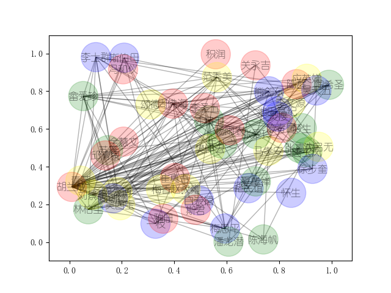

# python-
# 目标
首先，对《今生今世》语料进行处理。然后，挖掘抽取语料中每个人物之间的关系，并计算权重。最后，利用 networkx 画出人物网络关系图。
# 效果图

1. 利用 relationship_view.py 对《今生今世》语料（jsjs.txt）进行处理；
2. 抽取语料中每个人物之间的关系，并计算权重，并保存到 edge.csv；
3. 最后，利用 networkxDemo.py 对 edge.csv 进行处理，并画出 网络关系图。

